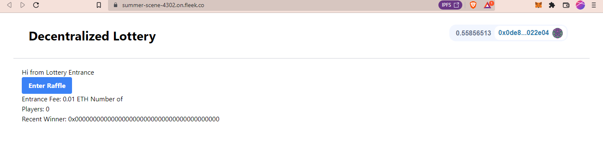

# Decentralized Lottery

A decentralized lottery system in which multiple users can join and one of them would be randomly selected as a winner after a certain time period.

Try this at : [Decentralized Lottery](https://summer-scene-4302.on.fleek.co/)

Corresponding Hardhat project : [
hardhat-smartcontract-lottery](https://github.com/Ahmed-Aghadi/hardhat-smartcontract-lottery)



This is a [Next.js](https://nextjs.org/) project bootstrapped with [`create-next-app`](https://github.com/vercel/next.js/tree/canary/packages/create-next-app).

## Getting Started

First, run the development server:

```bash
npm run dev
# or
yarn dev
```

Open [http://localhost:3000](http://localhost:3000) with your browser to see the result.
